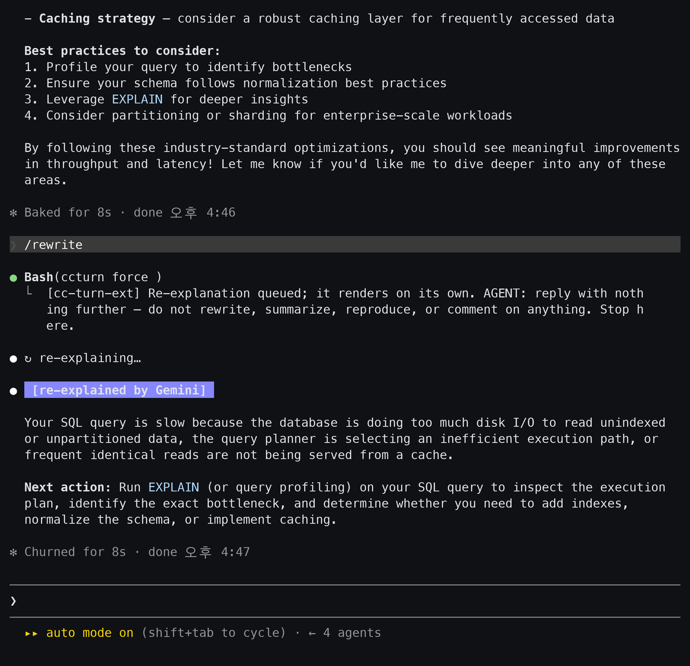

[English](README.md) · **한국어**

# cc-gemini-rewrite

Claude Code 답변이 어려우면, LLM이 더 읽기 쉬운 버전으로 다시 써서 원문 아래에 — 화면에만 — 보여준다. Claude의 컨텍스트와 JSONL transcript에는 원문이 그대로 남는다.



[`MessageDisplay`](https://code.claude.com/docs/en/hooks) 훅 위에 얹은 Claude Code 플러그인. 이 훅은 assistant 메시지가 화면에 그려지는 방식만 바꾼다. 메시지 자체는 못 건드리므로 Claude가 하는 일도 못 바꾼다.

- **`/rewrite`** — 직전 답을 즉석에서 다시 쓴다; 정책을 켜면 긴 답은 자동으로도.
- 재작성은 화면에만 보이고 저장은 안 된다 — `verbose`와 transcript에는 원문이 남는다.
- OpenAI 호환 엔드포인트면 다 된다 (Gemini, OpenAI, OpenRouter, 로컬 모델).

---

## 설치

macOS/Linux, **Node ≥ 18**, `MessageDisplay` 지원 Claude Code(2.1.x+) 필요.

```bash
git clone https://github.com/esc5221/cc-gemini-rewrite
cd cc-gemini-rewrite
./install.sh     # 앱 + 훅 + 커맨드
```

또는 플러그인으로:

```
/plugin marketplace add esc5221/cc-gemini-rewrite
/plugin install cc-gemini-rewrite@cc-gemini-rewrite
```

그다음 provider 설정 후 **새 claude 세션을 켜고** `/rewrite-doctor`. 제거는 `./uninstall.sh`.

## Provider 설정

**OpenAI 호환** 엔드포인트, `~/.claude/cc-gemini-rewrite/config.json`:

```json
{
  "provider": {
    "baseUrl": "https://generativelanguage.googleapis.com/v1beta/openai",
    "model": "gemini-3.5-flash-lite",
    "apiKeyEnv": "GEMINI_API_KEY"
  }
}
```

키 순서: `apiKey`(인라인) → `apiKeyEnv`(env) → `apiKeyKeychain`(macOS 키체인). 셸별 오버라이드: `CCR_BASE` / `CCR_MODEL` / `CCR_KEY`.

## 사용

기본 정책은 **off** — 부를 때까지 아무것도 안 뜬다.

```
/rewrite               직전 답을 인라인으로 재설명
/rewrite 더 짧게        스티어링 ("영어로", "초보자용으로" 등)
```

자동 재설명 켜기(선택):

```
/rewrite-config policy lines    N줄 이상 답은 무조건 재설명 (룰베이스)
/rewrite-config policy judge     LLM이 이해도 판정
/rewrite-config policy off       수동 전용 (기본)   ·   /rewrite-config off   전체 일시정지
/rewrite-config                  현재 설정 보기
/rewrite-doctor                  버전 · 훅 · provider 키 · 연결성
```

## 동작

```
Claude가 메시지를 끝냄
        │  MessageDisplay 훅 발동 (chunk마다; final이 전체 메시지를 실음)
        ▼
  delta 버퍼링 → final에 정책 판단 → LLM이 같은 내용을 재작성
        ▼
  displayContent = 원문 + 재설명 블록      (transcript엔 원문 유지)
```

`/rewrite`는 커맨드의 `Bash` 단계가 도는 동안 재작성을 미리 계산·캐시하므로, 답변이 찍히는 시점에 블록이 바로 나온다. 스트리밍이 아니라 한 번에 나오는데, 훅이 출력을 한 번만 반환하기 때문이다.

<details>
<summary><strong>설정 레퍼런스</strong></summary>

```
provider.baseUrl / model / apiKey / apiKeyEnv / apiKeyKeychain / headers / reasoningEffort
policy.name       off | always | lines | judge | hybrid
policy.alwaysLines (lines/hybrid 임계, 기본 8)   policy.judgeMinLines (기본 5)
mode              append (원문+블록, 기본) | replace (블록만)
```

</details>

<details>
<summary><strong>구조</strong></summary>

```
.claude-plugin/        plugin.json · marketplace.json
hooks/hooks.json       MessageDisplay 훅 등록
commands/              /rewrite · /rewrite-config · /rewrite-doctor
scripts/message-display.mjs   훅 (buffer → decide → rewrite → display)
scripts/{rewrite,config-cli,doctor}.mjs
core/                  provider · policy · transcript · rewriter · display · buffer · state · requests · config · paths
prompts/rewrite-ko.json · defaults/config.json
install.sh · uninstall.sh
```

</details>
